class: middle, center

# Scala ではじめる<br>マイクロサービス
## Lagom でチャットを実装してみよう！

???

Total: 1:25

* 0:10: 前説・STEP0
* 0:15: STEP1: API定義
* 0:15: STEP2: メッセージ配信
* 0:30: STEP3: 永続化
* 0:10: STEP4: CB
* 0:05: まとめ・質問

---

## 準備

下記 URL の手順に従って準備してください

1. ダッシュボードを開く: http://bit.ly/lagom-scala (Chrome 推奨)
2. IntelliJ IDEA を開く
3. `lagom-hands-on-delelopment.scala` のプロジェクトを開く
4. ターミナルで下記を実行
```bash
git fetch origin
git checkout step1
sbt runAll
```
---

## この勉強会のターゲット

* Lagom を使って Web アプリを開発できるようになりたい方
* Scala の基本的な文法を理解している方

.footnote[
  リハ専用ページ
]

---

## 私は何者？

* 根来 和輝 .whisper[Negoro Kazuki]
* TIS株式会社 生産技術R＆D室
* Reactive System に関する技術検証・コンサル
    * Lightbend Reactive Platform
        * Scala / Akka / Play framework

.with-twitter-icon[[@negokaz](https://twitter.com/negokaz)]
.with-github-icon[[negokaz](https://github.com/negokaz)]

???

私たちは Reactive System の推進をミッションとしていて、Lightbend Reactive Platform つまり
Scala や Akka、Play といった技術の検証やコンサルを おこなっています。

---
class: middle, center

# Scala ではじめる<br>マイクロサービス
## Lagom でチャットを実装してみよう！

---

## マイクロサービスアーキテクチャ？

* 2014年3月に ThoughtWorks社 の Martin Fowler によって提唱された
* 復数の小さいサービスを組み合わせて 一つのアプリケーションを構築するスタイルのこと
* デリバリスピードや可用性の面においてメリットがある

.whisper[※ 以降は MSA と略記]

???

さて、今回のテーマはマイクロサービスアーキテクチャです。

マイクロサービスアーキテクチャってなんなの？というところからご紹介したいと思います。

マイクロサービスアーキテクチャは ThoughtWorks社の Martin Fowler によって提唱された言葉です。
ざっくり言うと、「小さいサービスを組み合わせて 一つのアプリケーションを構築するスタイルのこと」です。
1つのシステムを小さいサービスに分割して、それぞれを疎結合にすることによって、様々な利点を得ることができます。

マイクロサービスアーキテクチャと言うのは長いので、以降は MSA と略します。

---

## MSA のトッピックス

* アプリ層の設計
* インフラ層の設計
* ドメイン駆動設計
* (人の)組織
* システム運用
* セキュリティ
* ...etc

???

MSAのトピックスといえばいろいろありますが、今日は

---

## 今日やること・やらないこと

* **アプリ層の設計**
* ~~インフラ層の設計~~
* ~~ドメイン駆動設計~~
* ~~(人の)組織~~
* ~~システム運用~~
* ~~セキュリティ~~
* ~~...etc~~

???

今日はアプリ層の話だけをします

---

## Lagom とは？

.height-3.center[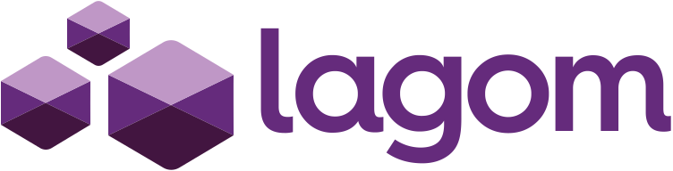]

* Lightbend社が3月にリリースしたMSA向けの<br>サーバーサイドフレームワーク
* 提供されている内部APIは Scala/Java
* コンセプトは **Reactive** *Microservices Architecture*
    * 大規模なシステムがターゲット

.footnote[
[https://www.lightbend.com/lagom](https://www.lightbend.com/lagom)

[Reactive Microservices Architecture (O’Reilly)](http://www.oreilly.com/programming/free/reactive-microservices-architecture.html)
]

???

* Scala API が出たのは 2/23

---

## Lagom が目指すもの

.center[
<iframe src="https://www.slideshare.net/slideshow/embed_code/key/bpqBuXOj1fENSp?startSlide=29" width="577" height="470" frameborder="1" marginwidth="0" marginheight="0" scrolling="no"></iframe>
]

.footnote[
[リアクティブ・アーキテクチャ ～大規模サービスにおける必要性と課題〜](http://www.slideshare.net/okapies/reactive-architecture-20160218-58403521)
]


???

Lagom は MSA を採用しつつ、リアクティブ・システムであることを目指しています。


リアクティブ・システムとは、いつでも、たとえ障害があったとしてもユーザーに一貫した速度でレスポンスを返す「即応性」があるシステムのことです。


それを実現するためには、負荷が高くなってもスケールして処理できるようにする「弾力性」


障害が起きたとしても、問題のある部分をすぐに切り離して応答性を維持する「レジリエンス」という性質が必要であると言われています。

---

## Lagom の特徴的な設計ポリシー

* サービス内部で使うAPIは全て**非同期API**
  .with-arrow[スレッドを使いまわしてリソースを節約]
* 外部APIの呼び出しは全て **Circuit Breaker** が有効
  .with-arrow[依存するサービスが応答できなくなっても 即応性を維持]

.footnote[
[Lagom #Lagom design philosophy](http://www.lagomframework.com/documentation/1.3.x/scala/LagomDesignPhilosophy.html)

[Lagom #Polyglot systems with Lagom](http://www.lagomframework.com/documentation/1.3.x/scala/PolyglotSystems.html)
]

???

このような性質を達成するための特徴的な設計ポリシーがあります。

---

## 詳しくはこちら

.center[
<iframe src="https://www.slideshare.net/slideshow/embed_code/key/xcxq7ErCS7Rg5" width="577" height="470" frameborder="1" marginwidth="0" marginheight="0" scrolling="no"></iframe>
]

.footnote[
[Lagom で学ぶ Reactive Microservices Architecture](https://www.slideshare.net/negokaz/lagom-reactive-microservices-architecture)
]

???

設計ポリシーについてより詳しく理解したい人はこちらを参照

---

## Lagom が提供する機能

* クラスタリングで分散処理
  * **Cluster Sharding**
* スケーラブルな永続化
  * **Event Sourcing**
  * **CQRS**
* 疎結合なコンポーネント間通信
  * **Pub-Sub**

.with-arrow[要件に応じて取捨選択が可能]

???

Lagom はこのような機能を提供していて、要件に応じて取捨選択できるようになっています

---

## ハンズオンで扱う機能

* ~~クラスタリングで分散処理~~
  * ~~Cluster Sharding~~
* スケーラブルな永続化
  * **Event Sourcing**
  * **CQRS**
* 疎結合なコンポーネント間通信
  * **Pub-Sub**

???

ハンズオンで扱うのはこの3つの機能です

---
class: middle, center

### Hands-On STEP 0
## 今日 Lagom で作るもの

???

Lagom の概要を知れたところで、今日作るものを説明します

---

## Lagom Chat

Slack のようなチャットアプリケーション

.center[
.with-border-frame.height-14[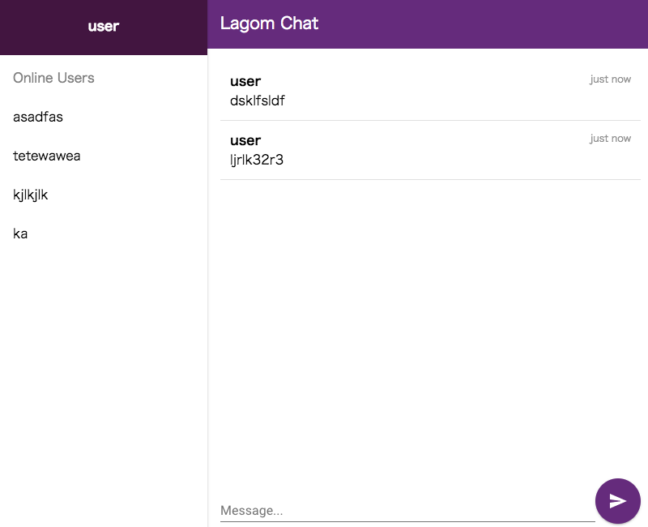]
]

???

今日は Slack のようなチャットの Web アプリを Lagom で実装します

---

## アーキテクチャ

* Frontend は SPA
* Backend とは REST で JSON 形式のデータをやりとり
* Backend の各サービスを Lagom で実装

.center[
.width-25[]
]

???

アーキテクチャはこんな感じです

Backend を構成するサービスは…

---

## Lagom Chat のサービス

* Web Gateway
.with-arrow[ユーザー認証・UIを提供]
* User Service
.with-arrow[ユーザー登録・参照]
* Message Service
.with-arrow[メッセージの投稿・配信]

???

3 つあります

---

## Lagom Chat のサービス構成


.as-underlay[
.height-14[]
]

???

各サービスの関係性はこのようになっていて、

--

.as-underlay[
.height-14[]
]

???

更新系の API は
* MessageService に対してメッセージを投稿
* UserService に対してユーザーの追加

--

.as-underlay[
.height-14[]
]

???

読取系の API は…

---

## 進捗状況

* .with-checkbox-on[Web Gateway]
* .with-checkbox-on[User Service]
* .with-checkbox-off[*Message Service*]
  * 重要な部分以外は既に実装済み
  
.with-arrow[メッセージの投稿と閲覧ができない状態]

???

既に一部はこちらで実装しておきました。でも、まだ一部未実装です。

---

## Message Service の API

下記のような API を想定して開発します

* チャットルームにメッセージを投稿できる
.with-arrow[`POST` `/api/messages/:userId`]
* 投稿されたメッセージをリアルタイムに確認できる
.with-arrow[`GET` `/api/messagestream` .whisper[(WebSocket)]]
* チャットルームに入る前のメッセージを確認できる
.with-arrow[`GET` `/api/messages`]

???


---
class: middle, center

### Hands-On STEP 1
## サービスの API を実装してみよう

???

【0:10: 前説・STEP0】

---

## アプリを起動

ターミナルからプロジェクト直下で`sbt runAll`を実行

.with-code-annotation[
`Terminal`
```bash
$ sbt runAll

~~~ ↓ (下記のログが表示されれば 起動完了) ↓ ~~~

[info] (Services started, press enter to stop and go back to the console...)
```
]

下記にアクセスしてログイン画面が表示されれば OK

http://localhost:9000

※ ソースの変更は自動反映されるため変更後の再起動は不要

---

## Message Service の API

下記の API を Message Service に実装します

* .with-checkbox-off[チャットルームにメッセージを投稿できる]
  * `POST` `/api/messages/:userId`
* .with-checkbox-off[投稿されたメッセージをリアルタイムに確認できる]
  * `GET` `/api/messagestream` .whisper[(WebSocket)]
* .with-checkbox-off[チャットルームに入る前のメッセージを確認できる]
  * `GET` `/api/messages`

???

このような API を MessageService のトレイトに実装していきます

---

## Message Service の API

まずは、一番単純な API を実装します

* .with-checkbox-off[チャットルームにメッセージを投稿できる]
  * `POST` `/api/messages/:userId`
* .with-checkbox-off[投稿されたメッセージをリアルタイムに確認できる]
  * `GET` `/api/messagestream` .whisper[(WebSocket)]
* .with-checkbox-off[**チャットルームに入る前のメッセージを確認できる**]
  * `GET` `/api/messages`

???

このような API を MessageService のトレイトに実装していきます

---
## これから見ていくファイル

1. Serivce の API を定義したトレイト
  * `message-api > MessageService.scala`
  * インターフェイスを定義する
2. 上記トレイトをミックスインした具象クラス
  * `message-impl > MessageServiceImpl.scala`
  * 具体的な処理を実装する

???

API の実装はこのような手順で行います

このステップでは、インターフェイスの定義を行います

---

## メッセージの一覧を取得

`GET` `/api/messages`

Response:
```javascript
HTTP/1.1 200 OK

[
  { body: "わーい！", user: "user1", timestamp: 1488866889258 },
  { body: "すごーい！", user: "user2", timestamp: 1488866889259 }
]
```

???

リクエストが来たら単純にJSONでリストを返す

---

## MessageService の descriptor を定義

.with-code-annotation[
`com.example.lagomchat.message.api.MessageService`
```scala
// ServiceCall を返す抽象メソッド (定義済み)
def messages(): ServiceCall[NotUsed, Seq[Message]]
```
]

.with-code-annotation[
`com.example.lagomchat.message.api.MessageService`
```scala
override def descriptor = {
  import Service._
  named("message").withCalls(
    // TODO: パスとメソッドのマッピングを定義
*   pathCall("/api/messages", messages)
  ).withAutoAcl(true)
}
```
]

.footnote[
クラス名をクリックするとコピーされます

IntelliJ の `Navigate > Class...` でクラス名を指定してジャンプできます

(Win: Ctrl + N, Mac: ⌘ + N) 
]

???

★Hands-On★

---

## MessageServiceImpl を確認

`messages` はダミーのメッセージを返す

.with-code-annotation[
`com.example.lagomchat.message.impl.MessageServiceImpl`
```scala
override def messages(): ServiceCall[NotUsed, Seq[Message]] = ServiceCall { _ =>
  // TODO: メッセージの一覧を返す
* Future.successful(Seq(Message(body = "Welcome to Lagom Chat!!", user = "Bot", DateTime.now())))
}
```
]

---

## 実装の確認

下記にアクセス

http://localhost:9000/api/messages

MessageServiceImpl で実装されたダミーのメッセージが JSON で返ってくる

```json
[{body:"Welcome to Lagom Chat!!",user:"Bot",timestamp:1488866889258}]
```

---

## 実装の解説

.with-code-annotation[
`com.example.lagomchat.message.api.MessageService`
```scala
// ServiceCall を返す抽象メソッド (定義済み)
*def messages(): ServiceCall[NotUsed, Seq[Message]]
```
]

.with-code-annotation[
`com.example.lagomchat.message.api.MessageService`
```scala
override def descriptor = {
  import Service._
  named("message").withCalls(
    // TODO: パスとメソッドのマッピングを定義
*   pathCall("/api/messages", messages)
  ).withAutoAcl(true)
}
```
]

---

## pathCall

API のパスをメソッドにマッピングする

```scala
def pathCall[Request, Response](pathPattern: String, method: ScalaMethodServiceCall[Request, Response])
```

* 第一引数に API のパス
* 第二引数に `ServiceCall` を返すメソッド .whisper[(厳密には関数)]

を指定する。

---

## ServiceCall

サービスの API コールを抽象化したクラス

```scala
trait ServiceCall[Request, Response]
```

* 第一型引数が Request Body
* 第二型引数が Response Body

を表す。

---
name: json_mapping

## Request Body

JSON の Request Body が case class にマッピングされる

`ServiceCall[RequestMessage, _]` と宣言すると…

.with-array-to-bottom[
.with-code-annotation[
`Request Body (JSON)`
```javascript
{
   body: "メッセージ"
}
```
]
]
<div style="height:1rem"></div>
.with-code-annotation[
`com.example.lagomchat.message.api.MessageService`
```scala
case class RequestMessage(body: String) // ⇒ RequestMessage("メッセージ")
```
]

---

## Response Body

case class の Response Body が JSON にマッピングされる

`ServiceCall[_, Message]` と宣言すると…

.with-array-to-bottom[
.with-code-annotation[
`Request Body (JSON)`
```scala
Message(body = "Welcome to Lagom Chat!!", user = "Bot", timestamp = DateTime.now())
```
]
]
<div style="height:1rem"></div>
.with-code-annotation[
`com.example.lagomchat.message.api.MessageService`
```json
{
   body: "Welcome to Lagom Chat!!",
   user: "Bot",
   timestamp: 1488866889258
}
```
]

---

## pathCall

`ServiceCall` の型引数によってHTTPメソッドが決まる

| 型宣言 | HTTPメソッド |
|-------|-------------|
|`ServiceCall[NotUsed, _]`|`GET`|
|`ServiceCall[_, _]`|`POST`|

.footnote[
任意のHTTPメソッドを指定できる`restCall`という APIもある

[Lagom - Service descriptors #REST identifiers](https://www.lagomframework.com/documentation/1.3.x/scala/ServiceDescriptors.html#REST-identifiers)
]

---

## 実装の解説

.with-code-annotation[
`com.example.lagomchat.message.api.MessageService`
```scala
// ServiceCall を返す抽象メソッド (定義済み)
*def messages(): ServiceCall[NotUsed, Seq[Message]]
```
]

.with-code-annotation[
`com.example.lagomchat.message.api.MessageService`
```scala
override def descriptor = {
  import Service._
  named("message").withCalls(
    // TODO: パスとメソッドのマッピングを定義
*   pathCall("/api/messages", messages)
  ).withAutoAcl(true)
}
```
]

* API のパスは `/api/message`
* 第一型引数が `NotUsed` なので HTTP メソッドは `GET`
* Response Body は `Message` のリスト

---

## 他の API も定義してみよう

* .with-checkbox-off[**チャットルームにメッセージを投稿できる**]
  * `POST` `/api/messages/:userId`
.without-margin[
```scala
def sendMessage(userId: String): ServiceCall[RequestMessage, Done]
```
]
* .with-checkbox-off[**投稿されたメッセージをリアルタイムに確認できる**]
  * `GET` `/api/messagestream` .whisper[(WebSocket)]
.without-margin[
```scala
def messageStream(): ServiceCall[NotUsed, Source[Message, NotUsed]]
```
]
* .with-checkbox-on[チャットルームに入る前のメッセージを確認できる]
  * `GET` `/api/messages`
.without-margin[
```scala
def messages(): ServiceCall[NotUsed, Seq[Message]]
```
]

.footnote[
`withCalls` にカンマ区切りで復数定義できる
]

???

★Hands-On★

実装してもらった部分を少し詳しく見ていきます

---

## メッセージの投稿

`POST` `/api/messages/:userId`

Request:
```javascript
{
   body: "メッセージ"
}
```

Response:
```javascript
HTTP/1.1 200 OK
Content-Length: 0
```

???

メッセージの投稿の API はこのような Request を投げると、このような Response が返ってくるという仕様にします。

`userId`

---

## メッセージの投稿

.with-code-annotation[
`com.example.lagomchat.message.api.MessageService`
```scala
def sendMessage(userId: String): ServiceCall[RequestMessage, Done]
```
]

* 引数の `userId` はパスの `:userId` を受け取る
* `ServiceCall` の
  * 第一型引数は投稿内容を表す `RequestMessage`
  * 第二型引数は処理完了を表す `Done`

--

引数をとるため、`_` で関数に変換して `pathCall` に渡す
```scala
pathCall("/api/messages/:userId", sendMessage _)
```

---

## メッセージのストリーム .small[(WebSocket)]

`GET` `/api/messagestream`

Frames:
.with-code-annotation[
`JSON`
```javascript
{ body: "わーい！", user: "user1", timestamp: 1488866889258 }
{ body: "すごーい！", user: "user2", timestamp: 1488866889259 }
```
]

???

誰かがメッセージを投稿すると、Web Socket を通じてメッセージが配信されます

---
name: def_message_stream

## メッセージのストリーム .small[(WebSocket)]

.with-code-annotation[
`com.example.lagomchat.message.api.MessageService`
```scala
def messageStream(): ServiceCall[NotUsed, Source[Message, NotUsed]]
```
]

Response を `Source[_, _]` にすることによって
WebSocket の API を定義できる

* ストリームデータの **入力** を表す
* 第一型引数が入力データの型
* 第二型引数はストリーム終了時に得られる型
  * 使わないので `NotUsed`

???

ストリーム: 終わりがいつ来るのかわからないデータ

---

## descriptor の完成形

下記のようになっていれば、完成です

.with-code-annotation[
`com.example.lagomchat.message.api.MessageService`
```scala
override def descriptor = {
  import Service._
  named("message").withCalls(
    // パスとメソッドのマッピングを定義
*   pathCall("/api/messages/:userId", sendMessage _),
*   pathCall("/api/messagestream", messageStream),
*   pathCall("/api/messages", messages)
  ).withAutoAcl(true)
}
```
]

---

## Message Service の具象クラスを実装

.with-code-annotation[
`com.example.lagomchat.message.impl.MessageServiceImpl`
```scala
override def sendMessage(userId: String) = ServiceCall { requestMessage =>
  // TODO: メッセージを PubSub に publish する
  // TODO: メッセージを Entity に送る
* println(s"$requestMessage from $userId")
  Future.successful(Done)
}
```
]

* requestMessage: <br>JSON の値がマッピングされた case class .small[([参照](#json_mapping))]
* メッセージが POST されたらターミナルに表示

???

★Hands-On★

---

## 間に合わなかった場合

下記のコマンドでブランチを`step2`に切り替えてください

.with-code-annotation[
`Terminal`
```bash
git checkout step2
```
]

---

## 実装の確認

Web Gateway には既に Message Service を呼び出す
機能が実装されている

http://localhost:9000/

* .with-checkbox-on[ログインできる]
* .with-checkbox-on[ダミーのメッセージが表示される]
* .with-checkbox-on[*ターミナルに*投稿したメッセージが表示される]

.with-code-annotation[
`Terminal`
```bash
RequestMessage(わーい！) from user1
RequestMessage(すごーい！) from user1
```
]

---

## Web Gateway 上の実装 .small[(参考)]

.with-code-annotation[
`controllers.ChatController`
```scala
def receiveMessage = Authenticated.async { implicit request =>
  request.body.asJson.flatMap(_.validate[RequestMessage].asOpt).map { msg =>
*  messageService
*     .sendMessage(request.user)
*     .invoke(msg)
      .map(_ => NoContent)
  }.getOrElse(Future.successful(BadRequest))
}
```
]

`ServiceCall#invoke()` をコールしてサービスを実行する

.with-arrow[Message Service に対してHTTPリクエストが発行される]

---
class: middle, center

### Hands-On STEP 2
## メッセージを配信してみよう

???

【0:25: STEP1: API定義】

---

## メッセージを配信してみよう

他のユーザーが投稿したメッセージを リアルタイムに確認したい

1. メッセージがクライアントから POST される
2. メッセージを他のクライアントに配信する

.with-arrow[**PubSub** を使うと簡単に実装できる]

---

## PubSub？

Publish-Subscribe パラダイムのメッセージングを
簡単に実現するためのモジュール

.foreground[
.height-10[]
]

--


.foreground[
.height-10[]
]

---

## メッセージの配信を実装

投稿されたメッセージを配信するための Topic を作成

.with-code-annotation[
`com.example.lagomchat.message.impl.MessageServiceImpl`
```scala
// TODO: メッセージを配信するための Topic を作成
*val topic = pubSub.refFor(TopicId[Message])
```
]

???

★Hands-On★

Topic は Slack のチャネルみたいなもの

---

## メッセージの配信を実装

作成した Topic に対してメッセージを `publish`

.with-code-annotation[
`com.example.lagomchat.message.impl.MessageServiceImpl`
```scala
override def sendMessage(userId: String) = ServiceCall { requestMessage =>
* val message = Message(requestMessage.body, userId, DateTime.now())
  // TODO: メッセージを PubSub に publish する
* topic.publish(message)
  // TODO: メッセージを Entity に送る
  println(s"$requestMessage from $userId")
  Future.successful(Done)
}
```
]

???

★Hands-On★

---

## メッセージの配信を実装

Topic の `subscriber` を `Future` で包んで返すだけ

.with-code-annotation[
`com.example.lagomchat.message.impl.MessageServiceImpl`
```scala
override def messageStream() = ServiceCall { _ =>
  // TODO: PubSub で subscribe したメッセージを流す
* Future.successful(topic.subscriber)
}
```
]

`subscriber` のシグネチャ:
```scala
def subscriber: Source[T, NotUsed] // T: ここでは Message
```

.footnote[
参照: [メッセージストリームの API 定義](#def_message_stream)
]

???

★Hands-On★

---

## PubSub の制約

* 到達保証はされない .whisper.sup[※1]
* サービスをまたいだメッセージ配信はできない

上記が必要な場合は [Message Broker API](https://www.lagomframework.com/documentation/1.3.x/scala/MessageBroker.html) を使う

.footnote[
※1 将来のリリースで解消される予定:
[Lagom - Publish-Subscribe #Limitations](https://www.lagomframework.com/documentation/1.3.x/scala/PubSub.html#Limitations)
]

---

## 間に合わなかった場合

下記のコマンドでブランチを`step3`に切り替えてください

.with-code-annotation[
`Terminal`
```bash
git checkout step3
```
]

---

## 実装の確認

http://localhost:9000/chat

* 既にチャット画面が開いている場合はリロード してください
* .with-checkbox-on[投稿したメッセージは他のユーザーからも確認できる]
  * シークレットウィンドウから他のユーザーでログイン
* リロードするとメッセージが消える

---
class: middle, center

### Hands-On STEP 3
## メッセージを永続化する

???

0:40: STEP2: メッセージ配信

---

## Lagom における永続化

* 高い可用性とスケーラビリティを実現するため **Event Sourcing** と **CQRS** による永続化のしくみを備えている
* データストアは Cassandra と RDB が選択できる

.footnote[
[Lagom - Relational Database Persistent Entities](https://www.lagomframework.com/documentation/1.3.x/scala/PersistentEntityRDBMS.html)

[Lagom - Cassandra Persistent Entities](https://www.lagomframework.com/documentation/1.3.x/scala/PersistentEntityCassandra.html)
]

---

## Event Sourcing

* サービスの Entity で起きた**イベント**を永続化する

---

## Entity？

* DDD の文脈で集約ルートと呼ばれるもの
* 一意の ID で識別できる
* 状態をインメモリで持つ
* コマンドを受け取り、コマンドからイベントを作る
* イベントを永続化し、自身の状態を更新する
* 状態が失われたら**イベントを再生**して復元

---

## Event Sourcing

* サービスの Entity で起きた**イベント**を永続化する
* イベントは不変(immutable)
    * キャッシュ、コピー、共有が容易にできる
        * スケールしやすい
        * 耐障害性を高められる
* ロック不要
    * 高いスループットを実現できる

---

## Event Sourcing

* サービスの Entity で起きた**イベント**を永続化する

.center[
.height-13[]
]

---

## Event Sourcing

* デメリット
  * データの集計にコストがかかる
  .with-arrow[**CQRS** で解決できる]

---

## CQRS

* *C*ommand and *Q*uery *R*esponsibility *S*egregation
    コマンドクエリ責務分離
* コマンド(書き込み)とクエリ(読み込み)を分離する

.center[
.height-10[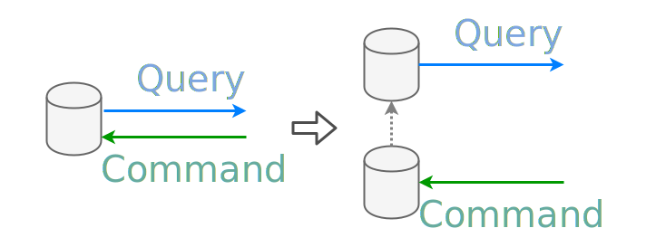]
]

---

## CQRS

.center.without-margin[
.height-8[]
]
.without-margin[
書き込み側と読み込み側で
* 異なるDB・データ構造が使える
* 別々にスケールできるようになる
.with-arrow[Command-Side にイベントソーシングを使い<br>Query-Side に集計しやすい形で”永続化する]
]

---

## CQRS

.center[
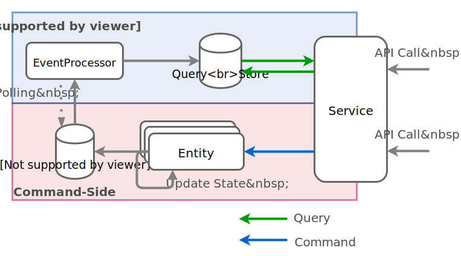
]

???

* Entity: 口座
* 不正なコマンドを弾く
  * 例: 残金が 100 円しかないのに、10000円引き出そうとする

---

## Entity を実装

`behavior` に Entity の状態ごとの振る舞いを定義する

.with-code-annotation[
`com.example.lagomchat.message.impl.RoomEntity`
```scala
override def behavior = {
  // ...(略)... //

  case RoomState(_, _) =>
    Actions()
      .onCommand[PostMessage, Done] {
        case (msg, ctx, state) =>
          // TODO: MessagePosted を永続化する
*         ??? 
      }
      .onEvent {
        case (_: MessagePosted, state) =>
          // TODO: state の countOfMessage をインクリメントする
*         ???
      }
}
```
]

--

.float-top-16.glass-deep[
* `onCommand`: コマンドからイベントを作成して永続化
* `onEvent`: イベントに基いて Entity の状態を更新
.with-arrow[ここでは簡単にメッセージ数をカウント]
]

---

## Entity を実装

コマンドとイベントをきっかけにする処理を実装
.with-code-annotation[
`com.example.lagomchat.message.impl.RoomEntity`
```scala
override def behavior = {
  // ...(略)... //

  case RoomState(_, _) =>
    Actions()
      .onCommand[PostMessage, Done] {
        case (msg, ctx, state) =>
          // MessagePosted を永続化する
*         val msgId = UUID.randomUUID()
*         val event = MessagePosted(msgId, state.roomId, msg.message, msg.user, msg.timestamp)
*         ctx.thenPersist(event)(_ => ctx.reply(Done))
      }
      .onEvent {
        case (_: MessagePosted, state) =>
          // state の countOfMessage をインクリメントする
*         state.incrementsMessages
      }
}
```
]

???

★Hands-On★

---

## EventProcessor に定義されたクエリ

イベントに基いてデータを更新するクエリ

.with-arrow[`processMessagePosted` として定義済 ↓]

.with-code-annotation[
`com.example.lagomchat.message.impl.RoomEventProcessor`
```scala
// 定義済み
private def processMessagePosted(e: EventStreamElement[MessagePosted]): Future[List[BoundStatement]] = {
  writeMessage.future.map { prepareStatement =>
    // INSERT INTO message (roomId, id, message, user, timestamp) VALUES (?, ?, ?, ?, ?)
    val bind = prepareStatement.bind()
    bind.setString("roomId", e.event.roomId)
    bind.setUUID("id", e.event.id)
    bind.setString("message", e.event.message)
    bind.setString("user", e.event.user)
    bind.setTimestamp("timestamp", e.event.timestamp.toDate)
    List(bind)
  }
}
```
]

---

## EventHandler を登録する

`ReadSideHandler` に `EventHandler` として登録

.with-code-annotation[
`com.example.lagomchat.message.impl.RoomEventProcessor`
```scala
override def buildHandler(): ReadSideHandler[RoomEvent] = {
  val builder = readSide.builder[RoomEvent]("roomoffset")
  builder.setGlobalPrepare(createTable)
  builder.setPrepare(_ => prepareWriteUser())
  // Entity で起きたイベントを Read モデルに反映する
* builder.setEventHandler[MessagePosted](processMessagePosted)
  builder.build()
}
```
]

???

★Hands-On★

---

## メッセージ一覧を読み取る

EventProcessor で書き込んだデータを SELECT するだけ

.with-code-annotation[
`com.example.lagomchat.message.impl.MessageServiceImpl`
```scala
override def messages(): ServiceCall[NotUsed, Seq[Message]] = ServiceCall { _ =>
  // TODO: メッセージの一覧を返す
* cassandra
*   .select(
*     """
*       | SELECT message, user, timestamp
*       | FROM message
*       | WHERE roomId = ?
*       | ORDER BY timestamp ASC
*     """.stripMargin, RoomEntity.RoomId)
*   .map { row =>
*     Message(
*       body = row.getString("message"),
*       user = row.getString("user"),
*       timestamp = new DateTime(row.getTimestamp("timestamp"))
*     )
*   }
*   .runFold(Seq.empty[Message])((acc, e) => acc :+ e)
}
```
]

???

★Hands-On★

---

## Entity にコマンドを送る

.with-code-annotation[
`com.example.lagomchat.message.impl.MessageServiceImpl`
```scala
// TODO: Entity の参照を取得
*val entity = registry.refFor[RoomEntity](RoomEntity.RoomId)

override def sendMessage(userId: String) = ServiceCall { requestMessage =>
  val message = Message(requestMessage.body, userId, DateTime.now())
  // TODO: メッセージを Entity に送る
* entity.ask(PostMessage(message.body, message.user, message.timestamp)).map { _ =>
*   // メッセージを PubSub に publish する
*   topic.publish(message)
*   Done
* }
}
```
]

* `refFor` で Entity への参照を取得 .small[(Entity の ID は固定値)]
* `ask` を使って `PostMessage` を送信
* Entity から応答があったら、メッセージを `publish`

???

★Hands-On★

---

## 間に合わなかった場合

下記のコマンドでブランチを`step4`に切り替えてください

.with-code-annotation[
`Terminal`
```bash
git checkout step4
```
]

---

## 実装の確認

http://localhost:9000/chat

* .with-checkbox-on[リロードしても過去のメッセージが確認できる]
* .with-checkbox-on[新しいユーザーも過去のメッセージが確認できる]

---
class: middle, center

### Hands-On STEP 4
## Circuit Breaker を作動させる

???

【1:10: STEP3: 永続化】

---

## Circuit Breaker?

* 一定回数失敗するとAPIコールを遮断 (Open)
* 一定時間でAPIコールできる状態に (Half-Open)
* APIコールが成功すれば元に戻る (Close)

.center[

]

Lagom では全ての API コールで Circuit Breaker が有効

---

## User Service

下記のAPIからチャットルームに居る
ユーザーの一覧が確認できる

* `GET` http://localhost:9000/users

Response:
.with-code-annotation[
`JSON`
```javascript
[{"name":"user1"},{"name":"user2"}]
```
]

---

## User Service を止めてみましょう

`user-service.kill` を `true` に設定

.with-code-annotation[
`user-impl/src/main/resources/application.conf`
```javascript
user-service.kill = true
```
]

何度か API を呼び出す

.with-arrow[http://localhost:9000/users]

---

## User Serivce が停止

エラーの応答がすぐに返ってくるようになる

.center[
.width-26[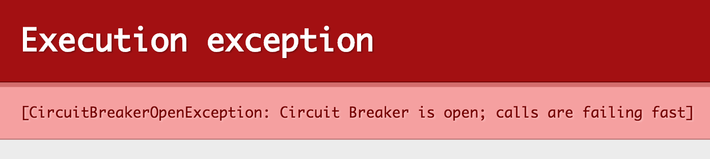]
]

---

## 何が起きたのか？

User Serivce の API が何度もタイムアウトになったため<br>
Web Gateway で Circuit Breaker が作動した

.center[
.height-14[]
]

---

## 障害から復旧させてみる

1. `user-service.kill` を `false` に設定 .small[(障害から復旧)]
2. 約 15 秒経過 .small[(Circuit Breaker が Half-Open になる)]
3. 再びユーザー一覧が取得できるようになる
.with-arrow[http://localhost:9000/users]

---
class: middle, center

# まとめ

---

## ハンズオンで体験した機能

Lagom は大規模な MSA に必要な機能を備えている

* PubSub
.with-arrow[メッセージの配信を簡単に]
* ES + CQRS
.with-arrow[Read/Write 両方のスケーラビリティ]
* Circuit Breaker
.with-arrow[障害を切り離してシステム全体を落とさない]

???

【1:20: STEP4: CB】

---

## ハンズオンで体験しなかった機能

* クラスタリングで負荷分散
.with-arrow[Entity を復数のノードに分散配置することで、サービス単体をスケールアウトする]
* サービスを跨いだ PubSub
.with-arrow[[コレオグラフィ](http://qiita.com/kawasima/items/17475a993e03f249a077)で設計変更に強いシステムにする]

---
class: center

## Question?

<iframe src="https://wall2.sli.do/event/psvkzxqk"  width="800" height="500" frameborder=0></iframe>
